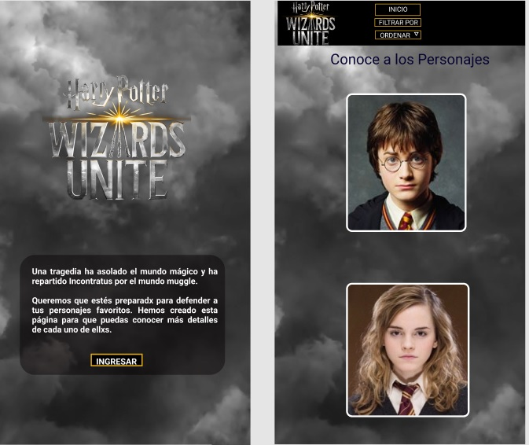

# Data Lovers

## Índice

* [1. Resumen del proyecto](#1-resumen-del-proyecto)
* [2. Objetivos de la web](#2-objetivos-de-la-web)
* [3. Planificación del proyecto](#3-planificación-del-proyecto)
* [3.1 Historias de usuario](#3.1-Historias-de-usuario)
* [4. Diseño de la Interfaz de Usuario](#4-Diseño-de-la-Interfaz-de-Usuario)
* [4.1 Prototipo de baja fidelidad](#4.1-Prototipo-de-baja-fidelidad)
* [4.2 Prototipo de alta fidelidad](#4.2-Prototipo-de-alta-fidelidad)
* [5. Implementación de la Interfaz de Usuario (HTML/CSS/JS)](#5-Implementación-de-la-Interfaz-de-Usuario-HTML/CSS/JS)
* [6. Objetivos de aprendizaje Data Lovers](#6-Objetivos-de-aprendizaje-Data-Lovers)

***

## 1. Resumen del proyecto
En este proyecto se creo una web responsive con datos valiosos de los personajes del juego el mundo magico de Harry Potter Wizards Unite.
pensada en todas las personas que estén interesadas en pertenecer en Wizards Unite, con esta web también podrán filtrar a sus personajes de acuerdo a su preferencia como por casa o varitas y ordenar alfabeticamente.

## 2. Objetivos de las web
- Conocer la funcionalidad de la web.
- Visualizar las características específicas de cada personaje a través de tarjetas.
- Ordenar alfabéticamente a los personajes.
- Conocer datos generales sobre las casas, núcleos de varitas y patronus.
- Filtrar los personajes según casa, varita y patronus.

## 3. Planificación del proyecto
Se comenzó leyendo los requisitos del proyecto, seguido de la organización como dupla para la realización de historias de usuario, prototipos de baja y alta fidelidad y pruebas con usuarios que nos dieron las pautas para mejorar el prototipo.

## 3.1 Historias de usuario

Las historias de usuario fueron el punto de partida para iniciar el proyecto. En un inicio se hizo seis historias en papel y se desarrollo más a detalle tres de ellas.

Luego se utilizo los tableros en Trello para poder hacer las modificaciones necesarias de manera más práctica y asi mantener el conecto entre la dupla.
Tablero Trello: https://trello.com/b/vqmL2UTM/data-lovers

## 4. Diseño de la Interfaz de Usuario

## 4.1 Prototipo de baja fidelidad

Al tener las historias de usuario concluidas se creo bocetos en papel, con pequeños detalles que fueron cambiando para mejorar la experiencia del usuario. Estos bocetos se testeo en equipo y se realizo feedback con otras personas para asi llegar al prototipo de alta fidelidad.

Este prototipo se testeo con ideas y sugerencias de personas a lazar los cuales fueron importantes para el proyecto:
- Las personas prefieren no registrarse si no reciben nada a cambio.
- La web dio la impresión que se podia jugar el juego Wizards Unite.
- Desean tener más información como las características de las casas y núcleos de varitas.

## 4.2 Prototipo de alta fidelidad

 ya realizada el prototipo en baja fidelidad con claridad de la web que se crearia, se realizó un prototipo de alta fidelidad en Figma.

## 5. Implementación de la Interfaz de Usuario (HTML/CSS/JS)

Luego de diseñar la interfaz de usuario trabajamos en la implementacion:

Luego de diseñar tu interfaz de usuario deberás trabajar en su implementación.
**No** es necesario que construyas la interfaz exactamente como la diseñaste.
No tienes tiempo ilimitado para trabajar, así es que deberás priorizar.

Como mínimo, tu implementación debe:

1. Mostrar la data en una interfaz: puede ser un card, una tabla, una lista, etc.
2. Permitir al usuario interactuar para obtener la infomación que necesita. <!--filtrar y ordenar la data.-->
3. Ser _responsive_, es decir, debe visualizarse sin problemas desde distintos
   tamaños de pantallas: móviles, tablets y desktops.
4. Que la interfaz siga los fundamentos de _visual design_.

### Pruebas unitarias

El _boilerplate_ de este proyecto no incluye Pruebas Unitarias (_tests_), así es
que  tendrás que escribirlas tú para las funciones que tenga tu código. <!--encargadas de  _procesar_, _filtrar_ y _ordenar_ la data, así como _calcular_
estadísticas.-->

Tus _pruebas unitarias_ deben dar una cobertura del 70% de _statements_
(_sentencias_), _functions_ (_funciones_), _lines_ (_líneas_), y _branches_
(_ramas_) del archivo `src/data.js` que contenga tus funciones y está detallado
en la sección de [Consideraciones técnicas](#srcdatajs).

## 6. Objetivos de aprendizaje Data Lovers
​
A continuación te presentamos los objetivos de aprendizaje de este proyecto. Reflexiona y luego marca los objetivos que has llegado a **entender** y **aplicar** en tu proyecto.
​
### UX
​
- [x] Diseñar la aplicación pensando y entendiendo al usuario.
- [x] Crear prototipos para obtener feedback e iterar.
- [x] Aplicar los principios de diseño visual (contraste, alineación, jerarquía).
​
### HTML y CSS
​
- [x] Uso correcto de HTML semántico.
- [x] Uso de selectores de CSS.
- [x] Construir tu aplicación respetando el diseño realizado (maquetación).
​
### DOM
​
- [x] Uso de selectores del DOM.
- [x] Manejo de eventos del DOM.
- [x] Manipulación dinámica del DOM.
​
### Javascript
​
- [x] Manipulación de strings.
- [ ] Uso de condicionales (if-else | switch).
- [ ] Uso de bucles (for | do-while).	
- [x] Uso de funciones (parámetros | argumentos | valor de retorno).
- [x] Declaración correcta de variables (const & let).
​
### Testing
- [ ] Testeo de tus funciones.
​
### Git y GitHub
- [x] Comandos de git (add | commit | pull | status | push).
- [x] Manejo de repositorios de GitHub (clone | fork | gh-pages).
​
### Buenas prácticas de desarrollo
- [ ] Uso de identificadores descriptivos (Nomenclatura | Semántica).
- [x] Uso de linter para seguir buenas prácticas (ESLINT).
